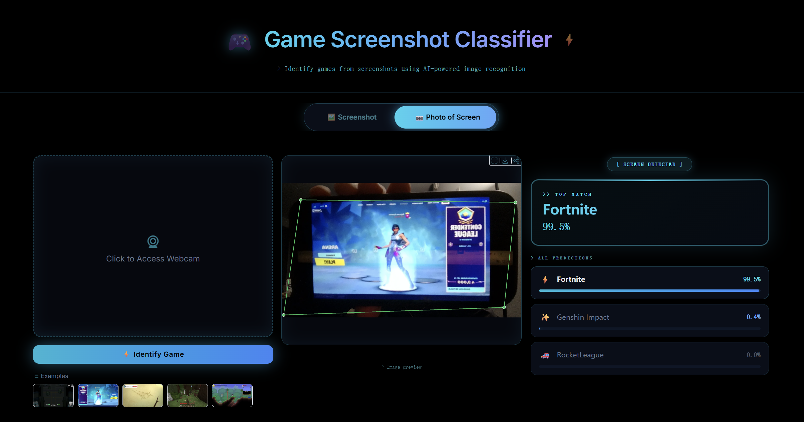
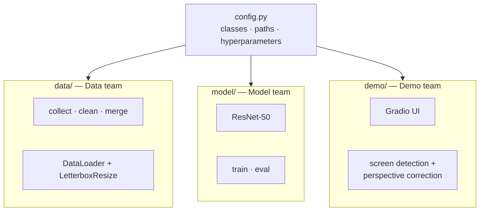
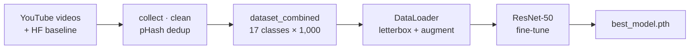
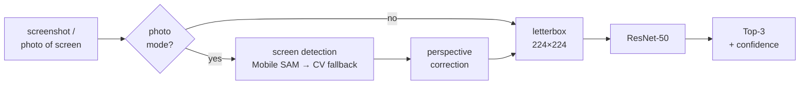
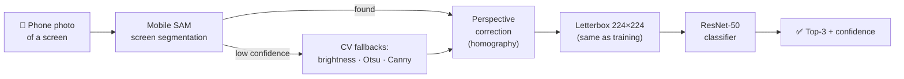
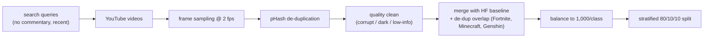
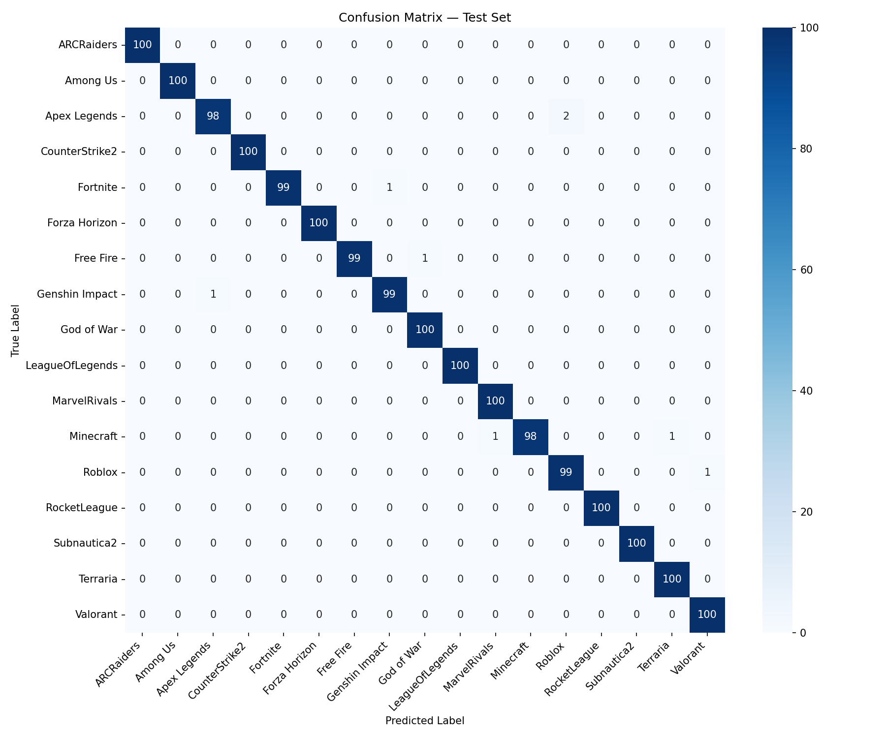
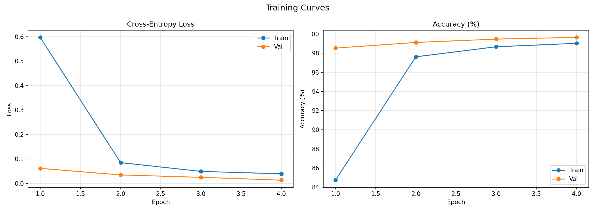

<div align="center">

# 🎮 Screenshot to Game Classifier

### Recognize a game from a clean screenshot — or even from a phone photo of someone else's screen.

<br/>


<br/>


<br/>



<sub><i>Photo-of-screen mode — a phone photo of a screen running Fortnite: the system detects the screen (green corners), corrects the perspective, and classifies it as <b>Fortnite (99.5%)</b>.</i></sub>

<br/>

**Machine Learning 2 · Final Project**
by **Yizhuo Li** · **Elaine Wang** · **Cecilia Hua** · **Cassie Li**

</div>

---

## 📖 Table of Contents

<table>
<tr>
<td valign="top" width="33%">

**Story**
- [The Problem](#-the-problem)
- [At a Glance](#-at-a-glance)
- [Supported Games](#-supported-games)
- [System Overview](#-system-overview)

</td>
<td valign="top" width="33%">

**Method**
- [Data Pipeline](#-data-pipeline)
- [Key Design: Letterbox Geometry](#-the-key-design-letterbox-geometry)
- [Model & Training](#-model--training-strategy)

</td>
<td valign="top" width="33%">

**Evidence & Use**
- [Results](#-results)
- [Live Demo](#-live-demo)
- [Quickstart](#%EF%B8%8F-quickstart)
- [Team · Limitations · Future Work](#-team--contributions)

</td>
</tr>
</table>

---

## 🎯 The Problem

> [!NOTE]
> Most image classification demos stop at clean inputs. The real world is messier — and that messiness is exactly what makes this project interesting.

Imagine seeing someone playing a game across the room. You like the look of it, but you have no idea what it is. You take a quick phone photo of their screen — at an angle, slightly blurry, with glare — and you want a system that can still tell you: *that's Genshin Impact*, or *that's Valorant*.

That single user story sets the entire problem definition for this project.

<table>
<tr>
<td align="center" width="50%">

### 🖼️ Direct Screenshot
*The easy case*

A clean frame straight from the game.
Crisp HUD, perfect framing, full resolution.

**Goal:** classify accurately and fast.

</td>
<td align="center" width="50%">

### 📷 Photo of a Screen
*The hard, realistic case*

A phone photo of a monitor or phone screen.
Perspective distortion · glare · blur · background clutter.

**Goal:** still classify correctly — by detecting the screen, correcting it, then classifying.

</td>
</tr>
</table>

**Why this matters for an ML project:** it forces decisions across the full stack — data design, preprocessing geometry, augmentation, model robustness, and inference-time computer vision — rather than just training a classifier on a fixed dataset.

---

## 🌟 At a Glance

<div align="center">

| 🧱 Architecture | 🗂️ Classes | 🖼️ Dataset | ✅ Test Accuracy | ⚡ Best Validation | 🕓 Training |
|:---:|:---:|:---:|:---:|:---:|:---:|
| ResNet-50<br/>(ImageNet→fine-tuned) | **17 games** | 17,000 frames<br/>(1,000 / class) | **99.53%** | **99.65%**<br/>(epoch 4) | Saturated in<br/>~4 epochs |

</div>

<table>
<tr>
<td valign="top" width="50%">

### ✨ What this project delivers

- 🖼️ **Screenshot classification** with Top-3 predictions and confidence.
- 📷 **Photo-of-screen mode** — phone-camera input, auto screen detection, perspective correction, then classification.
- 🧹 **Reproducible data pipeline** — YouTube collection, perceptual-hash de-duplication, quality cleaning, full provenance.
- 🎯 **99.53% test accuracy** across 17 game classes with per-class precision/recall mostly **98–100%**.
- 🧩 **Clean modular repo** — `data/`, `model/`, `demo/`, all coordinated by one `config.py`.

</td>
<td valign="top" width="50%">

### 🧰 Tech stack

- **Language:** Python 3.13
- **Model:** PyTorch · torchvision · ResNet-50
- **Computer vision:** Mobile SAM · OpenCV
- **Data:** yt-dlp · imagehash · HuggingFace `datasets`
- **Interface:** Gradio (screenshot + webcam modes)
- **Training:** stratified 80/10/10, early-stopped, GPU-accelerated

</td>
</tr>
</table>

---

## 🎮 Supported Games

A balanced set of **17 classes × 1,000 images each** — a mix of classic and current titles, covering different genres and visual styles.

<table>
<tr>
<td align="center" width="20%">👾<br/><b>Among Us</b></td>
<td align="center" width="20%">🎯<br/><b>Apex Legends</b></td>
<td align="center" width="20%">🤖<br/><b>ARC Raiders</b></td>
<td align="center" width="20%">🔫<br/><b>Counter-Strike 2</b></td>
<td align="center" width="20%">⚡<br/><b>Fortnite</b></td>
</tr>
<tr>
<td align="center">🏎️<br/><b>Forza Horizon</b></td>
<td align="center">🔥<br/><b>Free Fire</b></td>
<td align="center">✨<br/><b>Genshin Impact</b></td>
<td align="center">⚔️<br/><b>God of War</b></td>
<td align="center">🗡️<br/><b>League of Legends</b></td>
</tr>
<tr>
<td align="center">🦸<br/><b>Marvel Rivals</b></td>
<td align="center">🧱<br/><b>Minecraft</b></td>
<td align="center">🎮<br/><b>Roblox</b></td>
<td align="center">🚗<br/><b>Rocket League</b></td>
<td align="center">🌊<br/><b>Subnautica 2</b></td>
</tr>
<tr>
<td align="center">🌍<br/><b>Terraria</b></td>
<td align="center">💥<br/><b>Valorant</b></td>
<td align="center" colspan="3"><sub>Mix of HuggingFace baseline (10 classic) + self-collected YouTube (10 newer); 3 overlapping titles de-duplicated.</sub></td>
</tr>
</table>

---

## 🏗️ System Overview

The project is intentionally split into three sub-packages that all share one config contract. The same `LetterboxResize` transform is used in training, evaluation, and the demo so geometry is consistent everywhere.



### 🔁 Training pipeline



### 🎯 Inference pipeline



### 📷 Photo-of-Screen Pipeline

The signature feature: you can hand the demo a real-world photo, not just a screenshot.



| Step | Method | Why this design |
|---|---|---|
| 1️⃣ Detect the screen | **Mobile SAM** semantic segmentation (primary) | Robust to glare, lighting, weird angles |
| 2️⃣ Fallback when SAM is unsure | Brightness percentile → Otsu → Canny edge | Classical CV is reliable when neural confidence is low |
| 3️⃣ Correct perspective | Homography from detected quadrilateral | Turns an angled photo back into a flat rectangle |
| 4️⃣ Classify | Same `LetterboxResize` → ResNet-50 | Identical preprocessing as training — no distribution shift |

> [!IMPORTANT]
> This hybrid CV + deep learning design is what turns the project from *"another image classifier"* into a **real end-to-end system**.

### 🧩 Modules

| Module | Responsibility | Key tech |
|---|---|---|
| `config.py` | Shared contract: class names, paths, hyperparameters | — |
| `data/` | Collection · cleaning · merging · DataLoaders | yt-dlp · OpenCV · imagehash · HF `datasets` |
| `model/` | ResNet-50 fine-tuning · training · evaluation | PyTorch · torchvision · scikit-learn |
| `demo/` | Gradio frontend · screen detection · perspective correction | Gradio · Mobile SAM · OpenCV |

---

## 📦 Data Pipeline

> [!IMPORTANT]
> **Diversity matters more than volume.** The dataset is designed to teach the *game*, not a specific streamer, map, or video.

We combine two complementary sources into one **17-class** dataset:

<table>
<tr>
<td valign="top" width="50%">

### 🧪 Source 1 — Public baseline
**HuggingFace `Bingsu/Gameplay_Images`**

- 10 classic games × 1,000 images
- 640×360 PNG
- Provides a reproducible reference point and a fair public benchmark.

</td>
<td valign="top" width="50%">

### 🎥 Source 2 — Self-collected YouTube
**10 newer games no public dataset covers**

Valorant · CS2 · ARC Raiders · Marvel Rivals · Rocket League · Subnautica 2 · League of Legends · Forza Horizon · Free Fire · God of War — sampled from **real gameplay videos**, never thumbnails.

</td>
</tr>
</table>

### 🔧 How we collect, clean, and merge



| Stage | What it does | Why it matters |
|---|---|---|
| **Sourcing** | Several search queries per game, favoring *"no commentary, recent version, real gameplay"* | Avoids webcam overlays, stream decorations, outdated UI |
| **Download** | yt-dlp with Android-VR client + auto deno JS runtime | Bypasses YouTube SABR limits without manual ffmpeg muxing |
| **Frame sampling** | 2 fps over a 0:30–12:00 window, resized to 640×360 | Skips intro/outro, prevents single-video dominance |
| **pHash dedup** | Hamming distance < 8 → dropped | Games have many near-identical static shots |
| **Quality clean** | Drop corrupt, low-res, too-dark/bright, low-info frames | Keeps the dataset honest |
| **Provenance** | Manifest with source URL, timestamp, pHash | Fully traceable and reproducible |
| **Balance & split** | 1,000 per class, stratified 80/10/10, `seed=42` | Reproducible evaluation |

📄 Full methodology: **[DATA_COLLECTION.md](DATA_COLLECTION.md)**.

---

## 🧠 The Key Design: Letterbox Geometry

> [!TIP]
> **The biggest accuracy gain in this project came not from a bigger model, but from making input geometry match the task.**

Game frames are **16:9**. Most ML pipelines force a square. We tried three options:

<table>
<tr>
<td align="center" width="33%">

#### ❌ Square Resize
Stretches the frame.

UI elements, characters, and aspect ratios all distort.

</td>
<td align="center" width="33%">

#### ❌ Center Crop
Drops the edges.

Loses HUD, minimap, and ammo counters — exactly the most discriminative cues.

</td>
<td align="center" width="33%">

#### ✅ Letterbox Resize
Aspect-preserving + center-pad to 224×224.

No distortion. No lost edges. Identical geometry in training, evaluation, and demo.

</td>
</tr>
</table>

**Empirical evidence from an earlier 10-class experiment:** unifying geometry this way lifted test accuracy from **99.40% → 99.90%**. Geometry consistency, not model capacity, was the win — and the same `LetterboxResize` is reused everywhere in the codebase to guarantee it stays consistent.

---

## 🔬 Model & Training Strategy

<table>
<tr>
<td valign="top" width="50%">

### 🧱 Backbone

- **ResNet-50** pretrained on ImageNet (`IMAGENET1K_V2`)
- Fully fine-tuned
- Final FC layer replaced with a 17-class head
- Adam optimizer · lr `1e-4` · batch size 32
- 5 epochs configured; best checkpoint saved on validation

</td>
<td valign="top" width="50%">

### 🌪️ Augmentation — built for photo-of-screen

On top of standard flips and color jitter, we add augmentations specifically simulating the photo-of-screen case:

- `RandomAffine` (scale 0.85–1.0, translate 0.05)
- `RandomHorizontalFlip` · `RandomRotation(±15°)`
- `RandomPerspective(0.4)`
- `ColorJitter` · `RandomGrayscale`
- `GaussianBlur` · `RandomErasing`

These mimic tilt, blur, glare, and occlusion at training time.

</td>
</tr>
</table>

> [!NOTE]
> The model is intentionally **strong but not overcomplicated**. The project value lives in the full pipeline and robust input handling, not in stacking a bigger backbone.

---

## 📊 Results

<div align="center">

### 🎯 Headline Numbers

| Metric | Value |
|:---:|:---:|
| **Test accuracy** | **99.53%** (1,700 held-out images) |
| **Best validation accuracy** | **99.65%** (epoch 4, early-stopped) |
| **Per-class precision / recall** | **98–100%** across all 17 classes |
| **Convergence** | Saturated in **~4 epochs** |

</div>

### 📈 Visual evidence

<table>
<tr>
<td align="center" width="50%">

**Confusion Matrix**



<sub>Errors are rare and concentrated between visually similar games (photorealistic shooters, sandbox titles).</sub>

</td>
<td align="center" width="50%">

**Training Curves**



<sub>Validation accuracy saturates by epoch 4 — evidence that <b>data quality and geometry</b>, not model capacity, were the real bottleneck.</sub>

</td>
</tr>
</table>

### 📋 Per-class report (held-out test set, 1,700 images)

<details>
<summary><b>Click to expand full classification report</b></summary>

```
                 precision    recall  f1-score   support

     ARCRaiders       1.00      1.00      1.00       100
       Among Us       1.00      1.00      1.00       100
   Apex Legends       0.99      0.98      0.98       100
 CounterStrike2       1.00      1.00      1.00       100
       Fortnite       1.00      0.99      0.99       100
  Forza Horizon       1.00      1.00      1.00       100
      Free Fire       1.00      0.99      0.99       100
 Genshin Impact       0.99      0.99      0.99       100
     God of War       0.99      1.00      1.00       100
LeagueOfLegends       1.00      1.00      1.00       100
   MarvelRivals       0.99      1.00      1.00       100
      Minecraft       1.00      0.98      0.99       100
         Roblox       0.98      0.99      0.99       100
   RocketLeague       1.00      1.00      1.00       100
    Subnautica2       1.00      1.00      1.00       100
       Terraria       0.99      1.00      1.00       100
       Valorant       0.99      1.00      1.00       100

       accuracy                           1.00      1700
      macro avg       1.00      1.00      1.00      1700
   weighted avg       1.00      1.00      1.00      1700
```

</details>

### 🔍 What to notice

- ✅ The model **reaches strong performance in just 4 epochs** — meaning the dataset and preprocessing choices are doing real work.
- ✅ Errors are **rare and explainable** — they sit between games that genuinely look alike (photorealistic shooters, sandbox titles like Minecraft ↔ Roblox).
- ✅ The project is strong not only because of the final accuracy number, but because the **same model also supports the harder photo-of-screen scenario** through the hybrid CV pipeline.

---

## 🚀 Live Demo

The demo is a Gradio interface with **two modes**, both backed by the same trained model and the same letterbox geometry as training.

<table>
<tr>
<td valign="top" width="50%">

### 🖼️ Screenshot Mode

1. Upload a game frame
2. Get **Top-3 predictions** with confidence bars
3. The Top-1 class is shown as a highlighted card

Best for: showing baseline accuracy and clean classification quickly.

</td>
<td valign="top" width="50%">

### 📷 Photo of Screen Mode

1. The webcam auto-starts
2. Snap a photo of a monitor or phone screen
3. The system **detects the screen** (green corners), **corrects perspective**, then classifies
4. Top-3 with confidence is shown alongside the corrected preview

Best for: showing real-world robustness — the project's signature moment.

</td>
</tr>
</table>


<sub><i>Above: a phone photo of a Fortnite screen, auto-detected and rectified, then classified as <b>Fortnite (99.5%)</b>.</i></sub>

### 🎬 Run it locally

```bash
python demo/app.py
```

Opens at **<http://localhost:7860>** and prints a public `*.gradio.live` link you can share with anyone for a week.

> [!TIP]
> The repo ships a trained `checkpoints/best_model.pth`, so the demo runs without any training or data download.

---

## 🛠️ Quickstart

### 1. Install

```bash
pip install -r requirements.txt

# For photo-of-screen mode (Mobile SAM screen segmentation):
pip install git+https://github.com/ChaoningZhang/MobileSAM.git
```

> [!WARNING]
> **GPU note:** on RTX 50-series (Blackwell, sm_120), install the **cu128** torch build (nightly). cu121 / cu124 builds lack kernels for that architecture — `cuda.is_available()` returns True but kernels error at runtime.

### 2. Run the demo

```bash
python demo/app.py
```

### 3. Train & evaluate (optional)

Set `DATA_SOURCE=local` to use the 17-class merged set (otherwise it falls back to the online HF 10-class baseline).

<table>
<tr>
<td valign="top" width="50%">

**macOS / Linux (bash / zsh)**

```bash
export DATA_SOURCE=local
python model/train.py
python model/eval.py
```

</td>
<td valign="top" width="50%">

**Windows (PowerShell)**

```powershell
$env:DATA_SOURCE='local'; python model/train.py
$env:DATA_SOURCE='local'; python model/eval.py
```

</td>
</tr>
</table>

Outputs land in:
- `checkpoints/best_model.pth` — best validation checkpoint
- `results/training_history.json` — per-epoch loss / accuracy
- `results/classification_report.txt` · `confusion_matrix.png` · `training_curves.png`

---

## 📂 Project Structure

<details>
<summary><b>Click to expand the file tree</b></summary>

```
.
├── config.py                      # shared contract: classes, paths, hyperparameters
├── data/                          # DATA TEAM  → data/README.md
│   ├── data.py                    #   HF / local loading, stratified split, balancing, augmentation
│   ├── collect_data.py            #   YouTube download + frame sampling + pHash dedup (engine)
│   ├── collect_youtube_to_1000.py #   top up each YouTube class to 1,000 images
│   ├── export_hf_dataset.py       #   export the HF baseline to a local ImageFolder
│   ├── build_combined_dataset.py  #   merge dataset_hf + dataset_youtube_hq → 17 classes
│   ├── clean_data.py              #   filter corrupt / low-quality / duplicate frames
│   └── report_data.py             #   class distribution, size distribution, split plan
├── model/                         # MODEL TEAM  → model/README.md
│   ├── model.py                   #   ResNet-50 (FC layer replaced → 17 classes)
│   ├── train.py                   #   training loop, saves the best checkpoint
│   └── eval.py                    #   test evaluation, confusion matrix, training curves
├── demo/                          # DEMO TEAM  → demo/README.md
│   ├── app.py                     #   Gradio UI (screenshot / photo-of-screen)
│   └── screen_crop.py             #   screen detection + perspective correction
├── checkpoints/                   # model weights
│   └── best_model.pth             #   shipped 17-class model (test 99.53%)
├── results/                       # evaluation outputs
│   ├── classification_report.txt
│   ├── confusion_matrix.png
│   ├── training_curves.png
│   └── training_history.json
├── DATA_COLLECTION.md             # full data-collection methodology
├── requirements.txt
├── CONTRIBUTING.md
└── LICENSE                        # MIT
```

> **Run convention:** always run scripts **from the project root** (e.g. `python model/train.py`). Scripts add the root to `sys.path` to resolve `import config`; `checkpoints/` / `results/` / `examples/` / datasets are all paths relative to the root.

</details>

---

## 🔁 Reproducibility

<details>
<summary><b>Rebuild the dataset from scratch</b></summary>

```bash
# 1. Classic 10 classes from HuggingFace
python data/export_hf_dataset.py --output-dir dataset_hf

# 2. Self-collected 10 classes from YouTube
#    (first: winget install denoland.deno  — see DATA_COLLECTION.md)
python data/collect_youtube_to_1000.py
python data/clean_data.py --dataset-dir dataset_youtube_hq --apply
python data/report_data.py --dataset-dir dataset_youtube_hq

# 3. Merge into the 17-class training set
python data/build_combined_dataset.py
```

</details>

<details>
<summary><b>Train and evaluate end-to-end</b></summary>

```bash
export DATA_SOURCE=local
python model/train.py     # → checkpoints/best_model.pth + results/training_history.json
python model/eval.py      # → classification_report + confusion_matrix + training_curves
python demo/app.py        # → open http://localhost:7860
```

</details>

Full methodology and options are in **[DATA_COLLECTION.md](DATA_COLLECTION.md)**; per-stage details are in the folder READMEs (`data/README.md`, `model/README.md`, `demo/README.md`).

---

## 👥 Team & Contributions

<table>
<tr>
<td align="center" width="25%">
<b>Yizhuo Li</b><br/>
<sub>Model & Training</sub><br/><br/>
ResNet-50 fine-tuning, training loop, evaluation, results.
</td>
<td align="center" width="25%">
<b>Elaine Wang</b><br/>
<sub>Demo & Interface</sub><br/><br/>
Gradio UI, photo-of-screen mode, screen-detection UX.
</td>
<td align="center" width="25%">
<b>Cecilia Hua</b><br/>
<sub>Data Pipeline</sub><br/><br/>
YouTube collection, cleaning, balancing, methodology docs.
</td>
<td align="center" width="25%">
<b>Cassie Li</b><br/>
<sub>Integration & Presentation</sub><br/><br/>
Project packaging, integration, final repository, presentation flow.
</td>
</tr>
</table>

See **[CONTRIBUTING.md](CONTRIBUTING.md)** for development setup and project conventions (e.g. keeping the letterbox geometry in sync across training, evaluation, and the demo).

---

## ⚠️ Limitations

We tried to be honest about where the system can still struggle:

- 🌗 **Live screen detection depends on lighting and framing.** Heavy glare, very oblique angles, or a screen that takes up only a small fraction of the photo can defeat Mobile SAM and the CV fallbacks.
- 🎮 **Visually similar games remain harder.** Photorealistic shooters and sandbox games (Minecraft ↔ Roblox) are the most common confusions in the few errors we have.
- 📐 **The dataset is balanced and curated**, but it is sampled from publicly available gameplay — it does not yet include genuinely adversarial real-world photos at scale.
- 🧪 **Photo-of-screen accuracy is reported qualitatively** through the demo, not via a held-out quantitative photo benchmark.

---

## 🔮 Future Work

- 📷 Build a quantitative photo-of-screen evaluation set with real angled / glare / blur conditions.
- ⏱️ Latency and on-device optimization (e.g. ONNX export, mobile deployment).
- ➕ **Open-set recognition** — extending beyond a fixed 17-class set using a zero-shot vision-language model (e.g. CLIP) so the system can recognize and reject unknown games.
- 🎓 Optional **teacher → student knowledge distillation** as a future extension to make inference even faster while preserving accuracy.
- 🌐 Cleaner public-facing front-end and a hosted demo with a stable URL.

---

## 🙌 Acknowledgments

- [`Bingsu/Gameplay_Images`](https://huggingface.co/datasets/Bingsu/Gameplay_Images) — public baseline dataset.
- [MobileSAM](https://github.com/ChaoningZhang/MobileSAM) — lightweight Segment Anything used for screen detection.
- [yt-dlp](https://github.com/yt-dlp/yt-dlp) — YouTube downloading for data collection.
- Built with [PyTorch](https://pytorch.org/) and [Gradio](https://www.gradio.app/).

---

## 📜 License

Released under the **[MIT License](LICENSE)**. Data comes from public sources (HuggingFace + YouTube gameplay) and is used for study and research only; all game imagery belongs to its respective publishers.

---

<div align="center">

### 🎮 Built end-to-end — from real gameplay frames to a real-world photo demo.

<sub>Machine Learning 2 · Final Project · 2026</sub>

</div>
